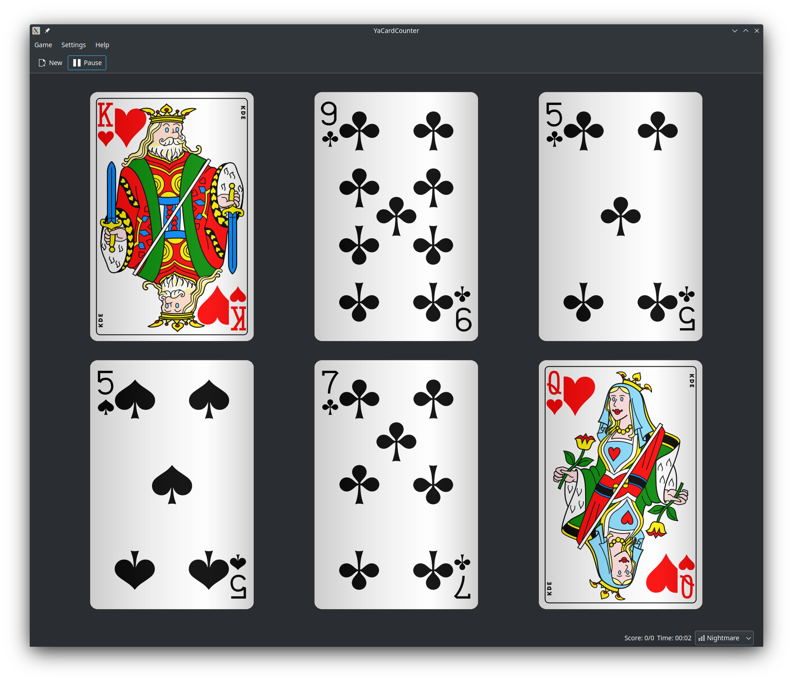

# YaCardCounter


[](https://www.codacy.com/gh/YaCodeLab/YaCardCounter/dashboard?utm_source=github.com&amp;utm_medium=referral&amp;utm_content=YaCodeLab/YaCardCounter&amp;utm_campaign=Badge_Grade)


**YaCardCounter** is an educational game developed and maintained by YaRiabtsev
as part of [YaCodeLab](https://github.com/YaCodeLab) organization. The project
aims to improve basic arithmetic skills and memory retention by counting cards
in different table-slots with different strategies. The user has the option to
use one of the preloaded strategies (Hi-Lo, Hi-Opt I, Hi-Opt II, Zen Count and
other) or create their own custom strategy. The game is implemented in C++ with
using Qt5, KF5, KF5KDEGames and carddeck packs from kdegames-card-data-kf5.

## Gameplay

|            |  |
|---------------------------------------------------------------------|-------------------------------------------------------------|
|  | todo:   |

At the beginning of the game, the user customizes the number of table-slots, and
for each table-slot, they can choose the number of standard playing card decks
and the strategy. The abstract dealer then picks up one card from one or more
table-slots (depending on the level of difficulty). The user must keep track of
the sum of the weight of the cards in each table-slot, taking into account the
weight assigned to each card in the chosen strategy.

If the next picked card is a joker, the user must answer a joker's question to
continue playing. The joker card has no weight and is rare, so answering
correctly about the current weight of the table-slot with the joker card changes
the score.

The score is based on the player's ability to answer the joker questions
correctly and is measured by the number of jokers the player has guessed
correctly out of the total number of joker questions.

The main focus of the game is to improve arithmetic skills and memory, and the
score serves as a motivational tool.

## Contributing

This project is open for contribution from other people who have more knowledge
in this area. If you're interested in contributing, please
contact [YaRiabtsev](https://github.com/YaRiabtsev) or open
an [issue](https://github.com/YaCodeLab/YaCardCounter/issues/new/choose) on the
GitHub repository.

To get involved/development it is recommended to read the documentation
and [configure the environment](https://community.kde.org/Get_Involved/development)
according to the specified steps.

After that, you can use the following commands to install and run:

```bash
cmake -B build/ -DCMAKE_INSTALL_PREFIX=$HOME/kde/usr/
cmake --build build/
cmake --install build/

source build/prefix.sh # located in the build directory
ya-cardcounter
```

You can find the
documentation [here](https://yacodelab.github.io/YaCardCounter/docs/html/).

## License

This project is licensed under the GNU General Public License v3.0.
